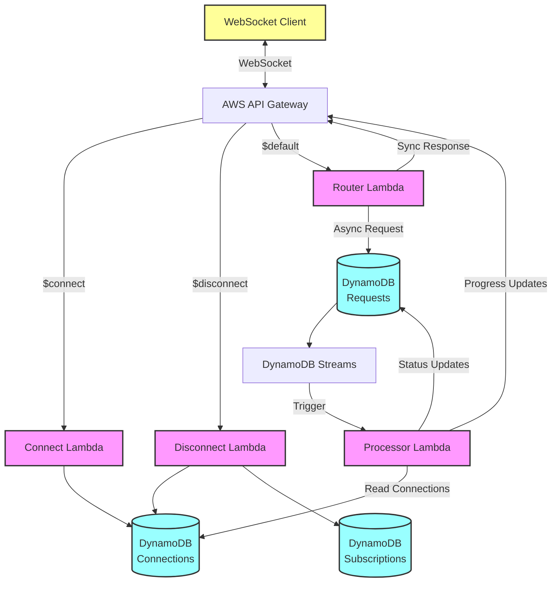

# Streamer Architecture - Final Documentation

## System Overview

The Streamer system provides real-time, asynchronous request processing with WebSocket-based progress updates. It handles both synchronous (quick) and asynchronous (long-running) operations seamlessly through a unified interface.

## Architecture Diagram



## Component Details

### 1. Connection Management

**Connect Lambda** (`lambda/connect/`)
- Validates JWT tokens
- Creates connection records in DynamoDB
- Stores user/tenant metadata
- Returns success/failure to API Gateway

**Disconnect Lambda** (`lambda/disconnect/`)
- Removes connection records
- Cleans up subscriptions
- Handles graceful disconnection

**Connection Store** (`internal/store/connection_store.go`)
- DynamoDB table: `streamer_connections`
- Schema:
  ```
  - connection_id (PK)
  - user_id
  - tenant_id
  - connected_at
  - last_ping
  - ttl
  ```

### 2. Request Routing

**Router Lambda** (`lambda/router/`)
- Receives all WebSocket messages
- Validates request format
- Determines sync vs async based on handler's `EstimatedDuration()`
- Sync threshold: 5 seconds

**Decision Flow:**
```go
if handler.EstimatedDuration() <= 5*time.Second {
    // Process synchronously
    result := handler.Process(ctx, request)
    return result
} else {
    // Queue for async processing
    queue.Enqueue(request)
    return QueuedResponse
}
```

### 3. Async Processing

**Processor Lambda** (`lambda/processor/`)
- Triggered by DynamoDB Streams
- Processes queued requests
- Reports progress via WebSocket
- Implements retry logic with exponential backoff

**Request Queue** (`internal/store/request_queue.go`)
- DynamoDB table: `streamer_requests`
- Schema:
  ```
  - request_id (PK)
  - connection_id
  - handler_type
  - payload
  - status (PENDING|PROCESSING|COMPLETED|FAILED)
  - created_at
  - completed_at
  - result
  - error
  - current_attempts
  - max_retries
  ```

### 4. Progress Reporting

**Progress System** (`pkg/progress/`)
- Real-time updates via WebSocket
- Intelligent batching (200ms intervals)
- Metadata support
- Automatic flush at 90%+ progress

**Message Flow:**
```
Handler → ProgressReporter → Batcher → ConnectionManager → API Gateway → Client
```

### 5. Handler System

**Handler Interface** (`pkg/streamer/handler.go`)
```go
type Handler interface {
    Validate(request *Request) error
    EstimatedDuration() time.Duration
    Process(ctx context.Context, request *Request) (*Result, error)
}

type HandlerWithProgress interface {
    Handler
    ProcessWithProgress(ctx context.Context, request *Request, 
                       reporter ProgressReporter) (*Result, error)
}
```

**Production Handlers:**
- `ReportAsyncHandler`: Multi-stage report generation with S3 integration
- `DataProcessorHandler`: ML pipeline with 5 processing stages
- Custom handlers can be easily added

## Key Design Decisions

### 1. Sync/Async Threshold
- 5-second threshold balances responsiveness and resource usage
- Prevents Lambda timeouts for WebSocket responses
- Allows quick operations to return immediately

### 2. Progress Batching
- Reduces WebSocket message volume
- 200ms batch intervals
- Maximum 5 updates per batch
- Immediate flush at high progress (>90%)

### 3. Retry Strategy
- Exponential backoff: 1s, 2s, 4s, 8s...
- Maximum 3 retries by default
- Validation errors don't trigger retries
- Failed requests stored with error details

### 4. Connection Lifecycle
- 24-hour TTL on connections
- Automatic cleanup of stale connections
- Graceful handling of disconnections

## Performance Characteristics

### Latency
- Sync requests: < 5 seconds
- Async requests: Initial response < 100ms
- Progress updates: 200-500ms intervals

### Throughput
- Router: ~1000 requests/second
- Processor: Limited by DynamoDB Streams (1000 records/second per shard)
- WebSocket connections: 10,000+ concurrent

### Resource Usage
- Lambda memory: 256MB (sufficient for most operations)
- Lambda timeout: 30s (router), 15m (processor)
- DynamoDB: On-demand pricing, auto-scaling

## Deployment Architecture

### Infrastructure Requirements
```yaml
Lambda Functions:
  - connect: 256MB, 30s timeout
  - disconnect: 256MB, 30s timeout
  - router: 256MB, 30s timeout
  - processor: 512MB, 15m timeout

DynamoDB Tables:
  - connections: On-demand, TTL enabled
  - requests: On-demand, Streams enabled
  - subscriptions: On-demand

API Gateway:
  - WebSocket API
  - Route selection expressions
  - $connect, $disconnect, $default routes
```

### Environment Variables
```
CONNECTIONS_TABLE=streamer_connections
REQUESTS_TABLE=streamer_requests
SUBSCRIPTIONS_TABLE=streamer_subscriptions
WEBSOCKET_ENDPOINT=wss://xxx.execute-api.region.amazonaws.com/stage
JWT_PUBLIC_KEY=<public key for token validation>
```

## Monitoring & Observability

### Key Metrics
- Request processing time (p50, p95, p99)
- Progress update latency
- Handler success/failure rates
- WebSocket connection count
- DynamoDB throttling events

### Logging
- Structured JSON logs
- Request/response correlation
- Error stack traces
- Performance timing

### Alarms
- Lambda errors > 1%
- Processing time > 5 minutes
- DynamoDB throttling
- WebSocket connection failures

## Security Considerations

### Authentication
- JWT token validation on connect
- Token refresh not required (connections expire)
- User/tenant isolation

### Authorization
- Handler-level permission checks
- Tenant-based data isolation
- Request validation

### Data Protection
- Encryption in transit (TLS)
- Encryption at rest (DynamoDB)
- No sensitive data in logs

## Future Enhancements

### Planned Features
1. Request prioritization
2. Batch request processing
3. Result caching
4. Custom retry policies
5. Request cancellation

### Scalability Improvements
1. Multi-region deployment
2. Read replicas for hot data
3. Request sharding
4. Connection pooling

### Operational Enhancements
1. Blue-green deployments
2. Canary releases
3. Automated rollbacks
4. Performance profiling

## Conclusion

The Streamer architecture provides a robust, scalable solution for handling asynchronous operations with real-time progress updates. Its modular design allows for easy extension while maintaining high performance and reliability. 